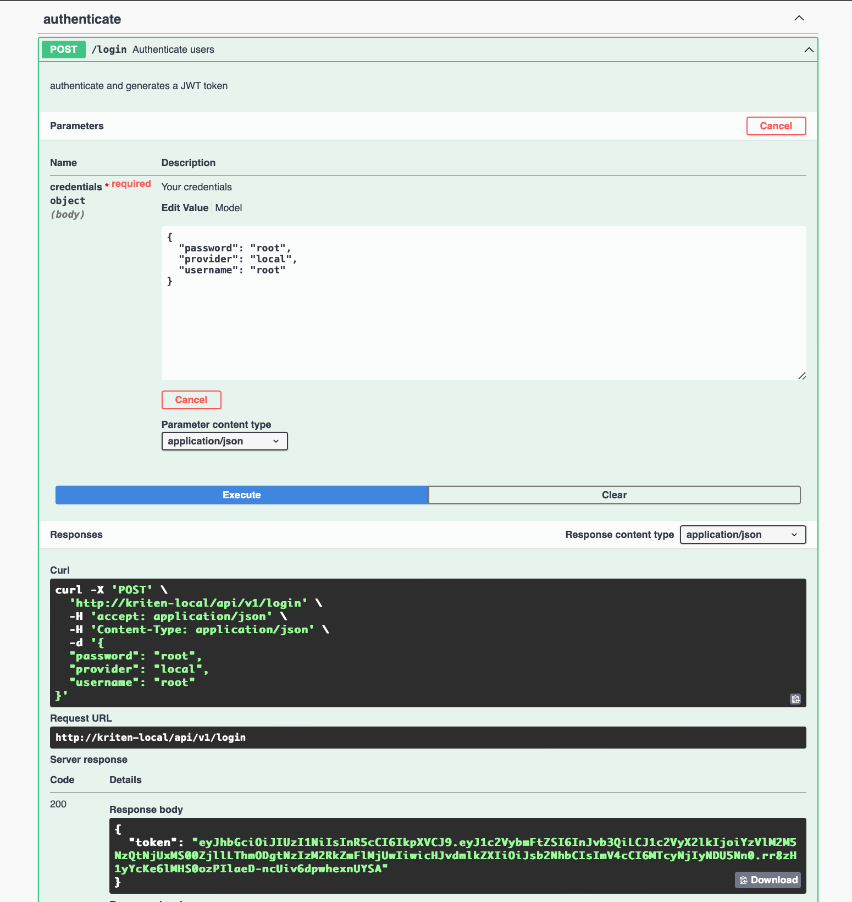
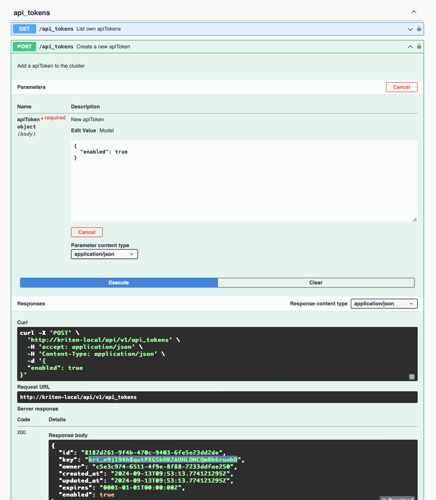
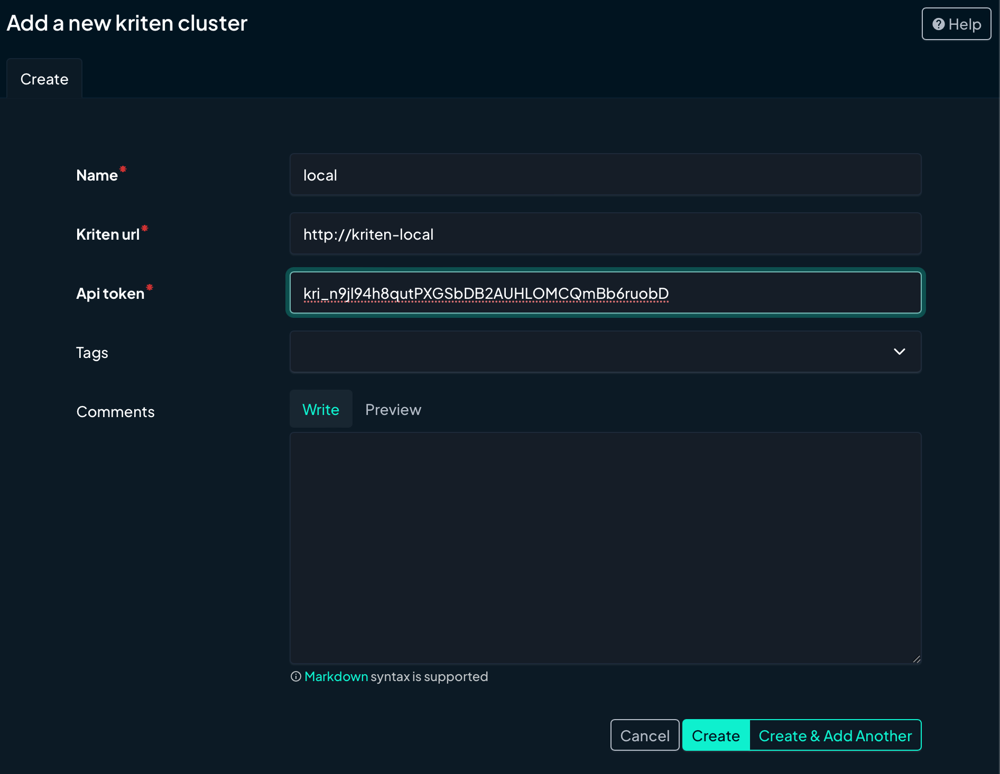
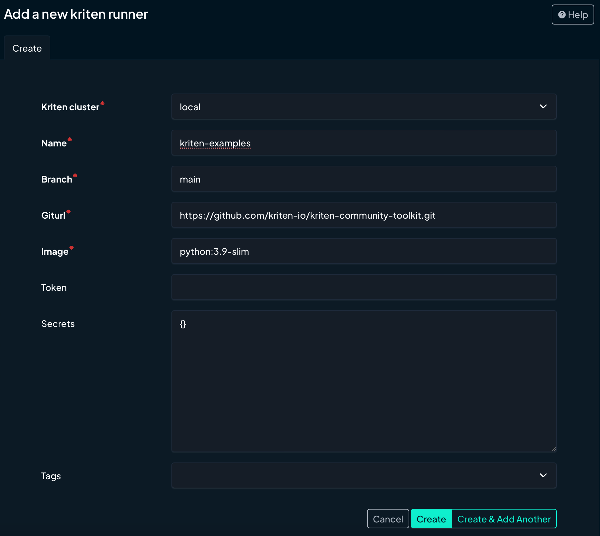
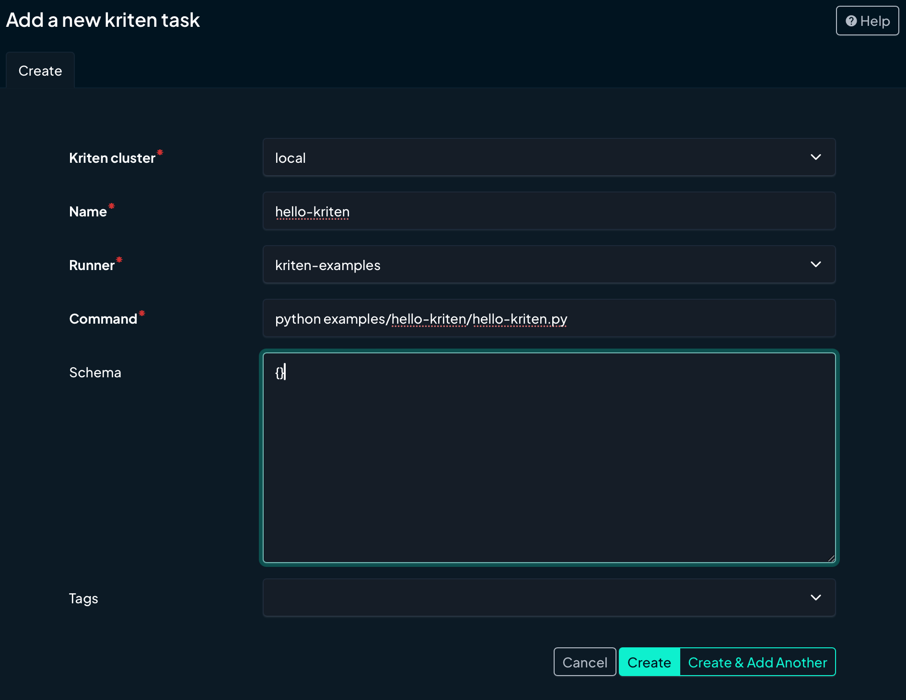
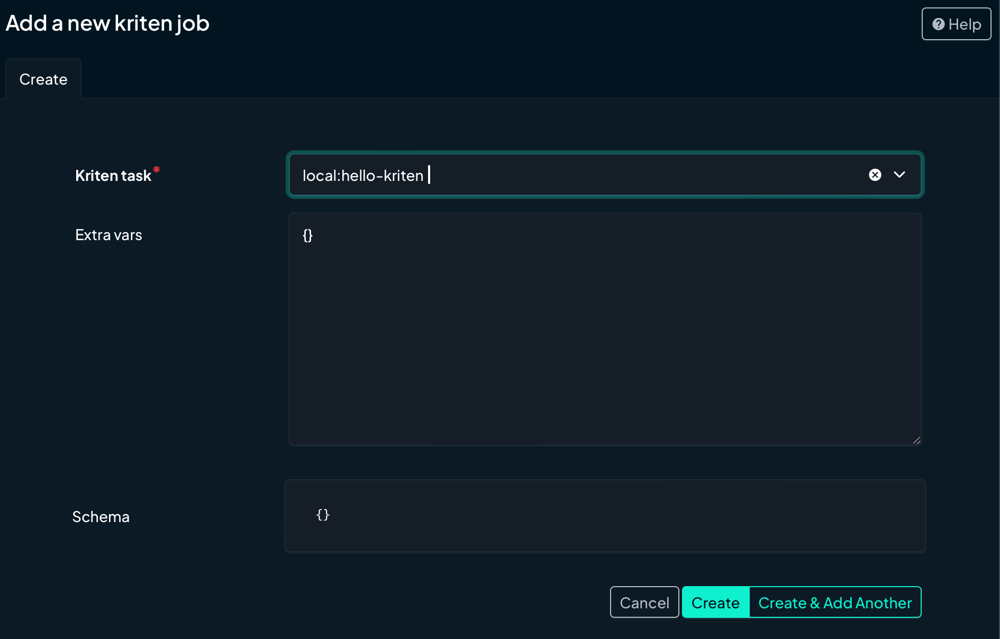
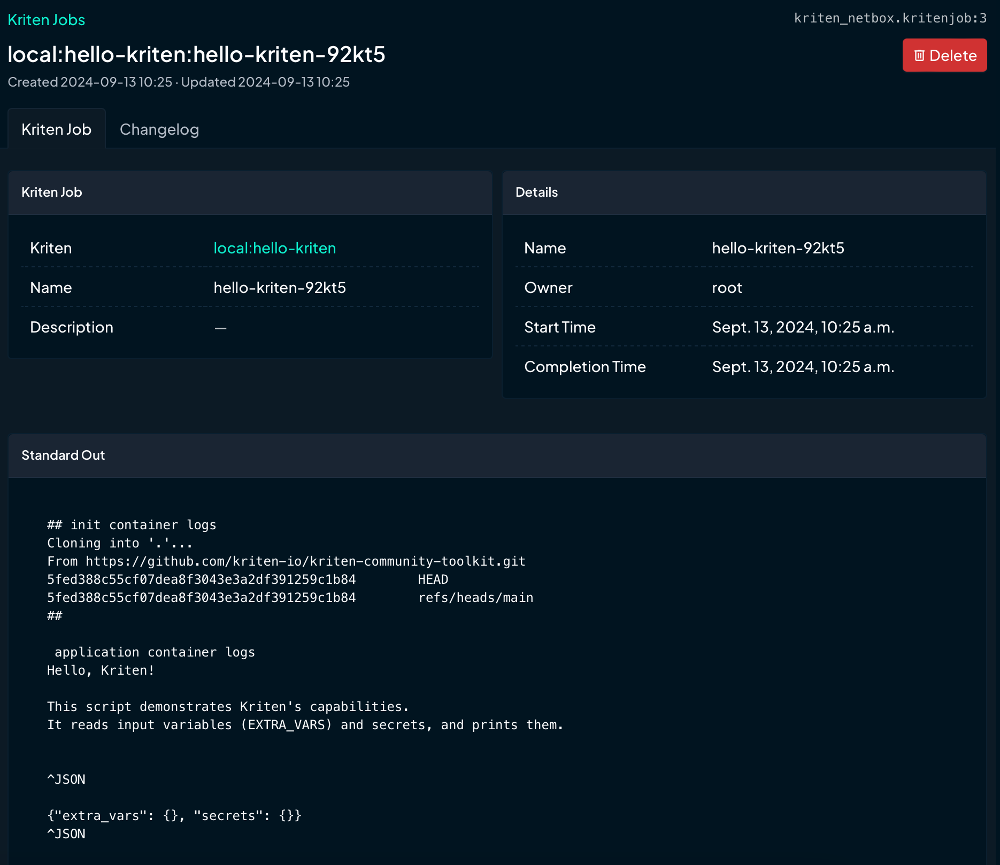

# Kriten NetBox Plugin

The Kriten NetBox Plugin allows control of Kriten deployments (clusters) from NetBox. You can add clusters, runners, tasks and launch jobs from the plugin.

Install Kriten and NetBox(with plugin). Instructions are [here](INSTALL.md).

### Login to Kriten
Open the Kriten swagger page http://kriten-local/swagger/api/index.html

### Create an API token

In NetBox, go to plugins > Kriten Clusters and add details of the local Kriten cluster.

This defines where code is stored and container image needed to run it.

A task is how to run a program stored in a runner git repository. There may be many tasks per runner depending how the repository is organiised.

You are now ready to run a job.

This job should not take long to run.
